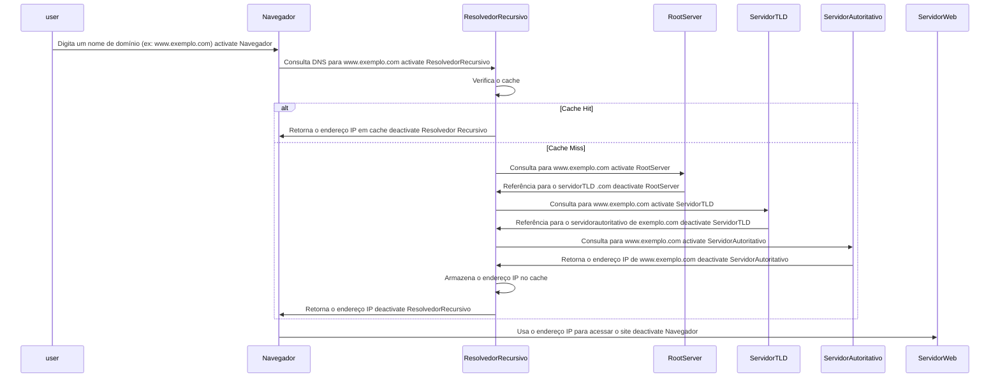
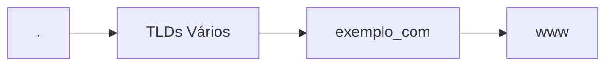
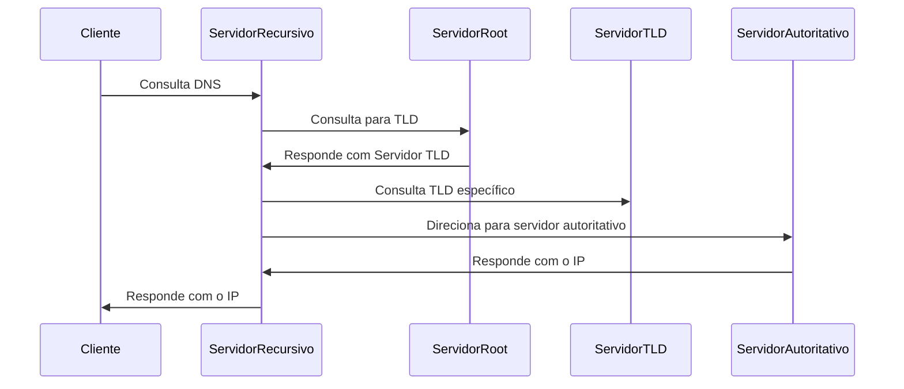
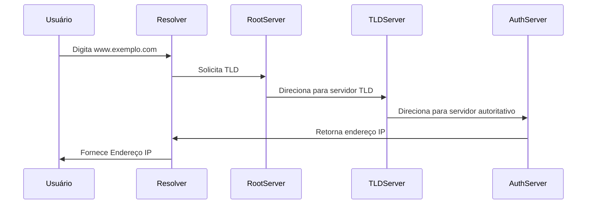
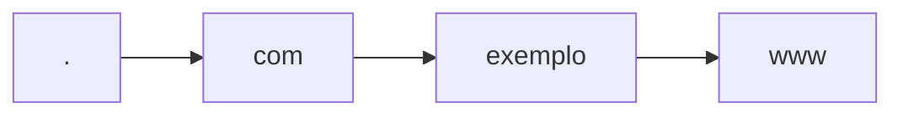
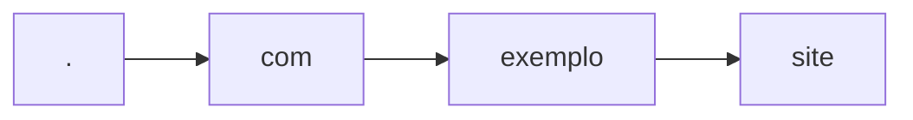

# tabnews-clone

## Installs

Init project

```bash
npm init
```

Install next

```bash
npm install next@13.1.6
```

Install react

```bash
npm install react@18.2.0
```

Install react-dom

```bash
npm install react-dom@18.2.0
```

Install prettier

```bash
npm install prettier -D
```

## Tests

Instalando test runner `jest`

```bash
npm install --save-dev jest@29.6.2
```

Para rodar

```bash
npm run test
```

## Protocols

- HTTP - Hypertext transfer protocol
- FTP - File transfer protocol
- SMTP - Simple mail transfer protocol
- TCP - Transmission control protocol
- UDP - User datagram protocol
- IP - Internet protocol

## CI na vercel

Nessa aula realizamos o cadastro na vercel, importamos nosso repo e realizamos o deploy.

URL: https://tabnews-clone-git-main-kaios-projects-54bd63fb.vercel.app/

## DNS

O DNS é a "lista telefônica" da internet, responsável por traduzir nomes de domínio legíveis por humanos, como "google.com", em endereços IP numéricos, como "172.253.89.147", que os computadores utilizam para se comunicar. Essa tradução é essencial para que os navegadores da web carreguem os recursos da internet.

"O DNS converte os nomes de domínio em endereços de IP para que os navegadores possam carregar os recursos da internet." - Cloudflare

Sem o DNS, seria necessário memorizar sequências numéricas complexas para acessar sites, tornando a navegação na internet uma tarefa árdua e pouco prática.

### Tipos de Servidores DNS

Existem quatro categorias principais de servidores DNS que trabalham em conjunto para entregar uma página da web:

- **Resolvedores Recursivos:** atuam como intermediários entre o cliente e os demais servidores DNS, encaminhando as solicitações e armazenando em cache as respostas para otimizar o processo.

"Um resolvedor recursivo (também conhecido como recursor DNS) é a primeira parada em uma consulta de DNS." - Cloudflare

- **Servidores Raiz:** formam o topo da hierarquia do DNS e direcionam o resolvedor para o servidor TLD correto, com base na extensão do domínio (.com, .net, .org, etc.).
  "Os 13 servidores-raiz de DNS são conhecidos por todos os resolvedores recursivos e são a primeira parada na busca por registros de DNS de um resolvedor recursivo." - Cloudflare
- **Servidores TLD:** armazenam informações sobre todos os domínios que compartilham uma extensão comum, como ".com" ou ".org".
  "Um nameserver TLD mantém informações sobre todos os nomes de domínio que compartilham uma extensão de domínio comum" - Cloudflare
- **Servidores Autoritativos:** contêm informações específicas sobre um determinado domínio e fornecem o endereço IP final ao resolvedor recursivo.
  "O nameserver autoritativo geralmente é o último passo do resolvedor na jornada para um endereço IP." - Cloudflare

  ### Como o DNS funciona?

  O processo de resolução de DNS ocorre em etapas, similar a uma busca em uma biblioteca. Quando um usuário digita um nome de domínio em seu navegador:

1. O resolvedor de DNS, geralmente fornecido pelo ISP, recebe a solicitação.
2. O resolvedor consulta um servidor raiz, que o direciona para o servidor TLD correspondente.
3. O servidor TLD indica o servidor autoritativo para o domínio específico.
4. O servidor autoritativo retorna o endereço IP ao resolvedor.
5. O resolvedor envia o endereço IP ao navegador, que finalmente carrega a página.
   "O resolvedor de DNS é a primeira parada da pesquisa de DNS e é responsável por lidar com o cliente que fez a solicitação inicial." - Cloudflare

### Tipos de Consultas DNS

Durante o processo de resolução, diferentes tipos de consultas DNS podem ser realizadas:

- **Recursiva:** o cliente solicita ao resolvedor que encontre a resposta completa, independentemente de quantas consultas forem necessárias.
- **Iterativa:** o servidor responde com a melhor informação que possui, podendo indicar outros servidores para continuar a busca.
- **Não recursiva:** o servidor possui a resposta em cache ou é autoritativo para o domínio, respondendo diretamente à consulta.

### Armazenamento em Cache DNS

O armazenamento em cache DNS é crucial para a velocidade e a eficiência do sistema. As informações de DNS podem ser armazenadas em cache em diversos locais, como no navegador, no sistema operacional e nos próprios servidores DNS. Isso permite que as consultas sejam resolvidas mais rapidamente, evitando repetidas buscas.

"O armazenamento em cache de DNS envolve o armazenamento de dados mais perto do cliente que os solicita, para que a consulta de DNS possa ser resolvida mais cedo." - Cloudflare

Segurança DNS
A segurança DNS é uma preocupação crescente, pois o sistema é vulnerável a ataques como spoofing e envenenamento de cache. Essas técnicas permitem que hackers redirecionem usuários para sites falsos ou interceptem informações confidenciais.

"Se eu fosse um hacker, eu poderia farejar ou entrar no meio desse tráfego, pegar esse tráfego e simplesmente olhar para ele sem nenhum problema." - NetworkChuck

Para aumentar a segurança, soluções como DNS over HTTPS (DOH) criptografam as consultas DNS, protegendo-as de interceptações. Serviços como o Cloudflare DNS e o Google Public DNS oferecem recursos de segurança aprimorados.

### Configuração de Resolvers DNS

Embora a maioria dos usuários utilize o resolvedor DNS fornecido pelo seu ISP, é possível configurar resolvedores alternativos, como o Google Public DNS, Cloudflare DNS ou até mesmo um servidor DNS próprio.

"Seu provedor de serviços de internet (ISP) geralmente fornece um resolvedor DNS padrão que seu dispositivo usa automaticamente. No entanto, você pode optar por configurar um resolvedor DNS diferente, se preferir." - Lenovo

A escolha de um resolvedor DNS pode impactar a velocidade de navegação, a segurança e a privacidade.

O DNS é um sistema complexo, porém essencial para o funcionamento da internet. Compreender seu funcionamento, os diferentes tipos de servidores, os métodos de resolução e as implicações de segurança é fundamental para garantir uma experiência de navegação segura e eficiente.



Entender o funcionamento do DNS é crucial para a administração de redes e para garantir a navegação eficiente e segura na internet. Ele assegura que cada consulta seja dirigida corretamente, permitindo assim a comunicação contínua entre diferentes dispositivos e redes ao redor do mundo.

### Root Domain

Demonstrando o conceito de domínio raiz, onde a resolução começa no nível mais elevado.



### Root Server

Ilustra o papel dos servidores raiz na consulta DNS.



### Resolver

Ilustra como um resolver recursivo processa a consulta DNS.



### FQDN

O exemplo a seguir demonstra a estrutura hierárquica de um FQDN, como `www.exemplo.com`.



#### Diagrama TLD

Este exemplo ilustra como um TLD funciona na estrutura DNS, usando o domínio .com.



### ccTLDs

Os ccTLDs (Country Code Top-Level Domains) são domínios de nível superior designados para representar países ou territórios específicos. Eles são compostos por duas letras, baseadas no código de país estabelecido pela norma `ISO 3166-1 alpha-2`. Por exemplo, `.br` é o ccTLD para o Brasil, `.fr` para a França, e `.jp` para o Japão.

#### Características dos ccTLDs:

1. Identidade Regional: Os ccTLDs são usados para identificar e localizar sites com base em sua origem ou foco geográfico. Eles ajudam a criar uma identidade regional distinta na internet.
2. Registro Local: Algumas nações impõem restrições no registro de seus ccTLDs, permitindo somente a residentes ou empresas do país registrar. Em outros casos, o registro pode ser aberto internacionalmente.
3. Uso Criativo: Embora inicialmente destinados a representar países, vários ccTLDs têm sido utilizados de forma criativa para fins de branding devido à sua combinação de letras atraentes. Por exemplo, .tv (Tuvalu) é popular na indústria televisiva.
4. Gestão Localizada: Cada ccTLD é gerido pela entidade nacional ou território designado, que determina as políticas de registro e operação.
5. Importância Comercial e Cultural: Para muitos negócios e organizações, usar um ccTLD pode indicar um foco no mercado nacional ou um compromisso com a cultura e comunidade local.

#### Exemplos de ccTLDs:

- `.us` - Estados Unidos
- `.uk` - Reino Unido
- `.de` - Alemanha
- `.cn` - China

Os ccTLDs são peças fundamentais na estrutura da internet, oferecendo tanto uma funcionalidade prática quanto uma oportunidade para marketing e identidade cultural. Eles ajudam a reforçar a presença local online, e entender seu uso é essencial para qualquer estratégia de presença na web.

Para mais detalhes, consulte a documentação oficial do [ICANN](https://www.icann.org/resources/pages/glossary-2014-02-03-en), que proporciona uma visão abrangente dos conceitos DNS usados pela Internet Corporation for Assigned Names and Numbers, a entidade responsável pela coordenação global do sistema DNS.

### gTLDs

Os gTLDs (Generic Top-Level Domains) são um dos principais tipos de domínios de nível superior na estrutura do DNS. Ao contrário dos ccTLDs, que são associados a locais geográficos específicos, os gTLDs são genéricos e podem ser usados globalmente por qualquer indivíduo ou organização. Eles são desenhados para representar conceitos mais amplos e geralmente não possuem restrições geográficas.

#### Tipos de gTLDs:

1. Tradicionais: Estes incluem domínios bem conhecidos como `.com`, `.org`, e `.net`. Originalmente, cada um tinha uma intenção específica (comercial, organização, rede), mas ao longo do tempo, seu uso se tornou amplamente livre e genérico.
2. Novos gTLDs: A partir de 2013, a ICANN (Internet Corporation for Assigned Names and Numbers) expandiu significativamente o número de gTLDs disponíveis, incluindo opções mais específicas e temáticas, como .guru, .photography, .xyz, entre outros. Isso permitiu maior personalização e criatividade na escolha de domínios.
3. Patrocinados (sTLDs): São gTLDs geridos por uma organização específica que estabelece regras de elegibilidade. Exemplos incluem .edu (reservado para instituições educacionais), e .gov (governos dos EUA).

#### Características dos gTLDs:

- Flexibilidade de Uso: gTLDs permitem registro sem se limitar a regiões, oferecendo flexibilidade para alcance global.
- Variedade e Criatividade: A multiplicidade de gTLDs oferece opções inovadoras para branding e representação online.
- Focos Temáticos: Muitos novos gTLDs são focados em nichos, permitindo que segmentos de mercado específicos beneficiem de marketing por meio de seus próprios domínios.

1. [ICANN gTLDs](https://www.icann.org/resources/pages/tlds-2012-02-25-en) - Página oficial do ICANN apresentando informações sobre gTLDs e a política de expansão dos novos domínios.
2. [Centralized Zone Data Service](https://czds.icann.org/en) - Serviço que fornece dados sobre domínios de nível superior, incluindo gTLDs, gerido pela ICANN.
   Os gTLDs proporcionam oportunidades variadas para registro de domínios, permitindo que empresas e indivíduos adotem nomes que melhor representam suas identidades, missões ou serviços na web, sem amarras geográficas.

## Conceitos SRE

- **SLA (Service-Level Agreement):** É um acordo com os usuários do seu serviço que garante que o SLO de disponibilidade será atendido dentro de um certo período. Se o SLO não for atingido, geralmente há uma penalidade, como reembolso parcial ou tempo de assinatura adicional. O SLA é um contrato, geralmente com clientes pagantes, que define o nível de serviço que eles podem esperar e as consequências se esse nível não for atingido
- **SLI (Service-Level Indicator):** É uma medida direta do comportamento de um serviço, como a frequência de sondagens bem-sucedidas do seu sistema. É usado para avaliar se um sistema está operando dentro do SLO. Em termos simples, é uma métrica que indica o quão bem seu serviço está funcionando.
- **SLO (Service-Level Objective):** É uma meta numérica para a disponibilidade do sistema. Define o nível de confiabilidade que um sistema deve atingir. O SLO serve como base para discussões sobre a confiabilidade do sistema e para decisões sobre mudanças de design. Essencialmente, é a meta de desempenho que você estabelece para seu serviço.

### Error budget

- O "error budget" representa a quantidade de indisponibilidade que um sistema pode tolerar dentro de um determinado período, sem violar o SLO (Service Level Objective) definido.
- O SLO estabelece a meta de disponibilidade do sistema, enquanto o "error budget" é o complemento dessa meta, representando o limite de erros ou tempo de inatividade aceitável.
- Por exemplo, se um SLO define uma disponibilidade de 99,9%, o "error budget" seria de 0,1%, representando a margem de indisponibilidade permitida.
- O "error budget" serve como uma ferramenta para tomar decisões estratégicas sobre o equilíbrio entre confiabilidade e velocidade no desenvolvimento de um sistema.
- Se um sistema está operando muito abaixo do limite do "error budget", pode ser mais apropriado priorizar o desenvolvimento de novas funcionalidades ou experimentos com a infraestrutura, pois há margem para riscos.
- Por outro lado, se o sistema está perto de consumir todo o "error budget", a prioridade deve ser a melhoria da confiabilidade e estabilidade para evitar a violação do SLO.

Em resumo, o "error budget" ajuda a quantificar e controlar o risco de indisponibilidade, auxiliando as equipes a tomarem decisões mais informadas sobre onde alocar esforços de desenvolvimento, seja em novas funcionalidades ou na confiabilidade do sistema.

## Modelo MVC

O MVC é um padrão de arquitetura de software. O MVC sugere uma maneira para você pensar na divisão de responsabilidades, principalmente dentro de um software web.

O princípio básico do MVC é a divisão da aplicação em três camadas: a camada de interação do usuário (view), a camada de manipulação dos dados (model) e a camada de controle (controller).

Com o MVC, é possível separar o código relativo à interface do usuário das regras de negócio, o que sem dúvida traz muitas vantagens que veremos mais à frente.

Quando falamos sobre o MVC, cada uma das camadas apresenta geralmente as seguintes responsabilidades:

- Model A responsabilidade dos models é representar o negócio. Também é responsável pelo acesso e manipulação dos dados na sua aplicação.

- View A view é responsável pela interface que será apresentada, mostrando as informações do model para o usuário.

- Controller É a camada de controle, responsável por ligar o model e a view, fazendo com que os models possam ser repassados para as views e vice-versa.


## POC e MVP

Um Proof of Concept (POC) é uma demonstração para verificar se uma ideia pode se tornar realidade, focando na sua viabilidade. Um Minimum Viable Product (MVP) é um produto com funcionalidades mínimas para atrair os primeiros clientes e validar a ideia no mercado.

**POC (Prova de Conceito):**

- O objetivo principal é testar a viabilidade da ideia, ou seja, se ela pode ser realizada e atende aos requisitos.
- Não busca demanda de mercado, mas sim praticidade.
- Ajuda a identificar problemas técnicos e logísticos.
- Geralmente precede o desenvolvimento completo do produto.
- Serve para convencer stakeholders sobre o potencial da ideia.

**MVP (Produto Mínimo Viável):**

- O objetivo principal é validar a ideia no mercado com o mínimo esforço.
- Busca atrair os primeiros clientes com funcionalidades básicas.
- Visa aprender o que ressoa com o mercado e coletar feedback dos usuários.
- É um produto funcional, que permite aos clientes completarem tarefas.
- Ajuda a minimizar tempo e recursos gastos em produtos que podem não ter sucesso.

Em resumo: O POC testa a viabilidade da ideia, enquanto o MVP testa o produto no mercado. O POC geralmente ocorre antes do MVP. Um POC bem-sucedido leva a um MVP.


## Curl

Request simples, com ela conseguimos visualizar o que é enviado para o servidor e o que ele retorna


```bash
curl localhost:3000 --verbose
```

Agora entender um pouco mais sobre headers, realizando uma request para o IP da vercel e informando o host para identificar nosso site hospedado

Aqui vamos obter apenas um redirect pois, não foi informado o host

```bash
curl https://76.76.21.21 --insecure -v
```

Uso Prático

Este tipo de comando é útil em situações onde você precisa testar configurações específicas do servidor web sem usar um navegador tradicionalmente (por exemplo, em ambientes de desenvolvimento local ou durante depurações). Além disso, pode ser utilizado para verificar comportamentos específicos do servidor sob diferentes condições (como respostas baseadas no cabeçalho "Host").

```bash
curl https://76.76.21.21 --insecure -v --header 'Host: curso.dev'
```

## URI Path Versioning

**URI Path Versioning** é uma estratégia amplamente utilizada para versionar APIs, onde o número da versão é incluído diretamente no caminho da URL. Isso torna a versão explícita e fácil de entender, facilitando a gestão de mudanças sem afetar clientes existentes.

### Características e Exemplos

- **Implementação Simples**: Incluir a versão no path é direto e intuitivo. Por exemplo:
  ```http
  GET /api/v1/users
  GET /api/v2/users
  ```

- **Vantagens**:
  - Fácil de implementar e entender.
  - Versões são claras e explícitas.
  
- **Desvantagens**:
  - Alterações na estrutura do URI podem afetar o cache.
  - Pode levar à duplicação de recursos se não for bem gerenciado[1][3].

### Considerações RESTful

Embora seja uma prática comum, alguns argumentam que o versionamento por URI não segue os princípios RESTful, pois recursos em REST não têm conceito de "versões". Alternativas como headers personalizados ou negociação de conteúdo são consideradas mais alinhadas com os princípios REST[4][5].

### Comparação com Outras Estratégias

| Método | Descrição | Exemplo |
|--------|-----------|---------|
| **URI Path Versioning** | Versão incluída no caminho do URI. | `GET /api/v1/users` |
| **Query Parameter Versioning** | Versão passada como parâmetro na URL. | `GET /api/users?version=1` |
| **Custom Request Headers** | Versão especificada em um cabeçalho personalizado. | `X-API-Version: v1` |

Cada método tem suas vantagens e desvantagens, dependendo das necessidades específicas da API[2][3].

## Header versioning

**Header Versioning** é uma estratégia de versionamento de APIs que utiliza cabeçalhos HTTP para especificar a versão desejada da API. Essa abordagem é considerada mais alinhada com os princípios RESTful, pois mantém o URI focado no recurso em si, sem incluir informações de versão.

### Características e Exemplos

- **Implementação**: Clientes podem especificar a versão desejada usando um cabeçalho personalizado. Por exemplo:
  ```http
  GET /api/users HTTP/1.1
  Host: example.com
  X-API-Version: v1
  ```

- **Vantagens**:
  - Preserva os URIs entre diferentes versões.
  - Adere aos princípios RESTful.
  
- **Desvantagens**:
  - Menos intuitivo do que o versionamento por URI.
  - Requer mais esforço para inspecionar as requisições, pois a versão está oculta nos cabeçalhos.

### Comparação com Outras Estratégias

| Método | Descrição | Exemplo |
|--------|-----------|---------|
| **URI Path Versioning** | Versão incluída no caminho do URI. | `GET /api/v1/users` |
| **Query Parameter Versioning** | Versão passada como parâmetro na URL. | `GET /api/users?version=1` |
| **Custom Request Headers (Header Versioning)** | Versão especificada em um cabeçalho personalizado. | `X-API-Version: v1` |

### Implementação Prática

Para implementar o header versioning, você pode usar bibliotecas ou frameworks que suportam essa funcionalidade, como ASP.NET Core ou Amazon API Gateway[2][4][5]. Além disso, ao usar esse método, é importante configurar corretamente os caches para lidarem com diferentes versões dos recursos[2].

### Caches e Vary Header

Ao utilizar header versioning, é crucial incluir o cabeçalho `Vary` nas respostas para garantir que proxies e caches sejam instruídos a armazenarem respostas diferentemente dependendo da versão solicitada:

```http
HTTP/1.1 200 OK
Content-Type: application/vnd.example.v1+json
Vary: Accept-Encoding, ExampleAPI-Version
```

Isso ajuda a evitar problemas de cache quando múltiplas versões são usadas simultaneamente[2].

## URI path versioning X header versioning

Quando se trata de versionamento de APIs, duas abordagens comuns são o **URI Path Versioning** e o **Header Versioning**. Cada uma tem suas vantagens e desvantagens, dependendo das necessidades específicas do projeto.

### URI Path Versioning

Nesta abordagem, a versão da API é incluída diretamente no caminho da URL. Por exemplo:

```http
https://example.com/api/v1/users
https://example.com/api/v2/users
```

**Vantagens:**
- Fácil de implementar e entender.
- Versões são claras e explícitas.
  
**Desvantagens:**
- Pode poluir os URIs.
- Alterações na estrutura do URI podem afetar o cache.

### Header Versioning

Aqui, a versão é especificada em um cabeçalho HTTP personalizado. Por exemplo:

```http
GET /api/users HTTP/1.1
Host: example.com
X-API-Version: 1
```

**Vantagens:**
- Mantém os URIs limpos e fáceis de ler.
- Oferece flexibilidade ao não depender da estrutura do URI.

**Desvantagens:**
- Requer mudanças no código cliente para incluir o cabeçalho customizado.
- Pode ser mais difícil debugar ou lidar com caches/proxies.

Em resumo, se você prioriza simplicidade e visibilidade das versões, o **URI Path Versioning** pode ser mais adequado. No entanto, se prefere manter os URIs limpos e ter flexibilidade na gestão das versões sem alterar a estrutura dos endpoints, então o **Header Versioning** é uma escolha melhor.

## Git tips

### Remover dados sensíveis

Existe situações, onde pode acontecer de subir algum dados sensível para o repositorio, sendo assim temos algumas maneiras de tratar esse tipo de situação.

Nesse [link](https://docs.github.com/pt/authentication/keeping-your-account-and-data-secure/removing-sensitive-data-from-a-repository), é documentados algumas formas de realizar esse clean up de dados sensíveis.

---

# References

- [HTML5 Games - UDP vs TCP](https://www.youtube.com/watch?v=ZEEBsq3eQmg)
- [Por dentro do GIT | #devadev com Jonathan Lima](https://www.youtube.com/watch?v=H2j7e81J798)
- [vercel](https://vercel.com/)
- [Root server](https://root-servers.org/)
- [iana cc-TLD](https://www.iana.org/domains/root/db)
- [Curso javascript](https://www.youtube.com/playlist?list=PLHz_AreHm4dlsK3Nr9GVvXCbpQyHQl1o1)
- [aspnet-api-versioning](https://github.com/dotnet/aspnet-api-versioning/issues/902)
- [Get-started-with-API-versioning-and-URIs](https://www.techtarget.com/searchapparchitecture/tip/Get-started-with-API-versioning-and-URIs)
- [Versioning-by-Header](https://github.com/dotnet/aspnet-api-versioning/wiki/Versioning-by-Header)
- [header-versioning](https://apibestpractices.info/versioning/header-versioning)
- [rest-api-versioning-best-practices](https://codedamn.com/news/backend/rest-api-versioning-best-practices)
- [api-versioning-url-vs-header-vs-media-type-versioning](https://www.lonti.com/blog/api-versioning-url-vs-header-vs-media-type-versioning)
- [how-to-manage-api-versioning-a-technical-guide](https://cyclr.com/blog/how-to-manage-api-versioning-a-technical-guide)
- [api-versioning-best-practices-for-managing-change-in-apis-1dgg](https://dev.to/getambassador2024/api-versioning-best-practices-for-managing-change-in-apis-1dgg)
